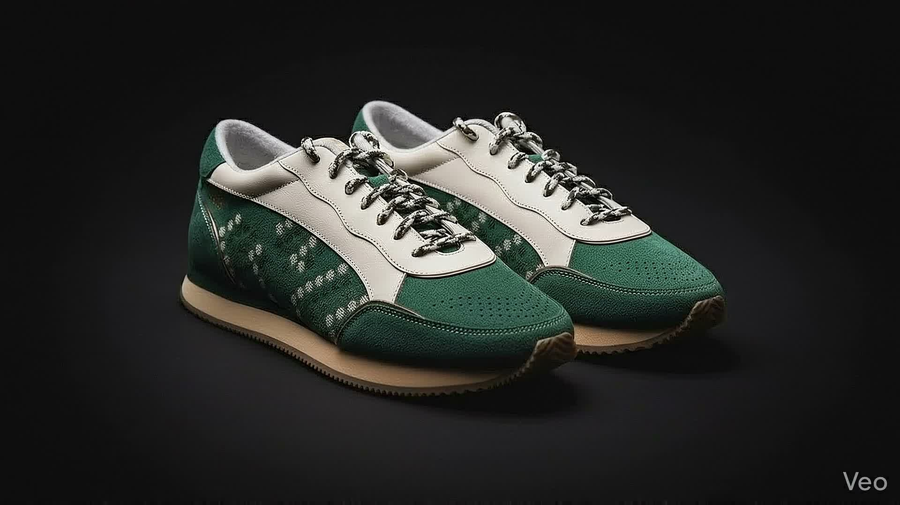

# गली Labs 92 - Cinematic Scrollytelling Landing Page

Welcome to the hyper-premium, Apple-level landing page for the **गली Labs 92** flagship Indian streetwear sneaker.



## 📌 Overview

This project is a high-end, editorial, cultural product story built with a pure dark-mode aesthetic. 
The core of the experience revolves around a buttery-smooth 240-frame hardware-accelerated scroll sequence where the green and white suede sneakers "explode" out into their constituent parts (gum sole, midsole, laces, upper panels) to highlight craftsmanship, and dynamically reassemble as the user continues to scroll.

## ✨ Features

- **Apple-Style Glassmorphism Navigation**: A sleek, near-black translucent fixed top navigation bar that fades in conditionally on scroll.
- **Cinematic Scrollytelling**: GSAP ScrollTrigger maps your viewport scroll progress precisely to the frame sequence of a 100vw/100vh `<canvas>`.
- **Pre-loading Optimization**: Ensures 60fps interaction with no frame flashing or stuttering by eagerly pre-caching 240 high-quality frames into memory.
- **Premium Typographic Scale**: Utilizing `Inter` and tracking-tight layout formulas to emphasize luxury editorial appeal.

## 🛠️ Built With

- **Vanilla HTML5 & CSS3**: Zero bloat, ensuring maximum flexibility and absolute control over the `#050505` deep black theme.
- **GSAP & ScrollTrigger**: For robust timelines, scrubbed scroll transitions, and absolute timeline synchronization.
- **Canvas API**: Raw `requestAnimationFrame` and image drawing to render the 240 sequence flawlessly underneath the HTML overlay texts.

## 🚀 How to Run Locally

You don't need any complex build steps. Since this leverages pure vanilla technologies:

1. Clone the repository:
   ```bash
   git clone https://github.com/sanchitk866-glitch/sneaker.git
   ```
2. Navigate into the directory:
   ```bash
   cd sneaker
   ```
3. Use any live server to run it. For example, if you have Python installed or Node.js:
    - **Using Python 3**:
      ```bash
      python -m http.server 8080
      ```
    - **Using Node/npx**:
      ```bash
      npx serve -p 8080
      ```
4. Open your browser to `http://localhost:8080` to experience the scroll flow.

## 🎨 Design System

**Colors**
*   **Primary Background**: `#050505` (seamless edge blending for the sneaker canvas)
*   **Secondary Background**: `#0A0A0C` (overlays)
*   **Text**: `rgba(255,255,255, 0.9)`
*   **Subtext**: `rgba(255,255,255, 0.6)`
*   **Accent Green**: `#1A4A1A` 
*   **Accent Gum**: `#C8714A`

## 📖 Component Scroll Phases

1. **0 - 15%**: Hero Phase - Fully assembled dramatic rim-lighting.
2. **15 - 40%**: Soft Explosion - Layers separate gracefully emphasizing construction.
3. **40 - 65%**: Material Closeups - Floating components highlight premium suede and gum outsoles.
4. **65 - 85%**: Cultural Identity - Brand story focus with glowing heel counter isolation.
5. **85 - 100%**: Reassembly Lock - Components snap back structurally for a satisfying CTA finish.

---
_Built for the streets. Born in India._
